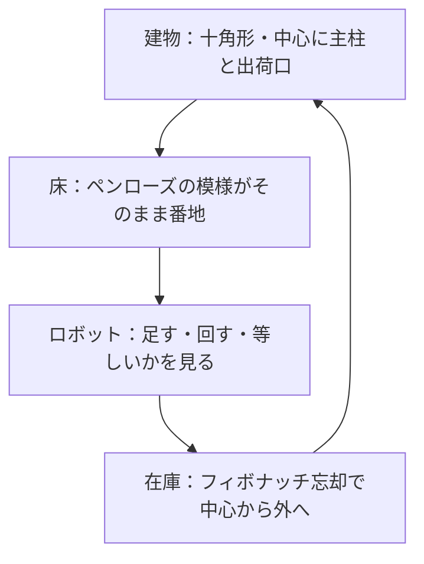

## ペンローズ型巨大配送センターの企画書

## 3つのキーワード

**1.建物は10角形のテント構造**
**2.床は、独自のペンローズタイリング構造で効率化**
**3.商品の取り出しはアメーバー型ロボットによる自動化**
**4.商品管理は、フィボナッチ忘却で販売頻度による一元管理**

ロジスティック企業の巨大倉庫の　**建物構造・棚の配置・ピッキングロボット・在庫管理**　のコンセプトをパッケージで提案する。

## 発想：アメーバー型ロボットは自分で道を探す

https://zenn.dev/morc_b13/articles/48e9ba0003edf6
https://zenn.dev/morc_b13/articles/9be44f04ec0d68

ロボットを賢くするとき、ふつうはセンサーを足し、判断規則を覚えさせる。この企画は逆を行く。**AI に大量の判断規則を覚えさせる前に、そもそも判断の要らない構造を作る。**

小さなロボットほど、計算資源も、記憶も、電力も、通信も足りない。だから判断をソフトウェアから構造へ移す。構造に移すから、ロボットの中核は数行で済む。

## 一段目：建物 ── 十角形のテント


- 建物は十角形。中心に主柱を一本立て、膜屋根で柱のない床を覆う
- ペンローズの五回対称の中心は一つだけ。主柱・出荷口・垂直搬送をそこに重ねる
- 中心が高く縁が低いテントの形に合わせ、よく出る商品ほど中心の高い棚、あまり出ない商品ほど縁の低い棚に置く
- **規模によらず同じ仕組み**：倉庫は「無限に広がる一枚のペンローズから切り取った窓」。広げるときは外側に層を足すだけで、内側の棚・通路・番地は一枚も変わらない

## 二段目：床 ── 模様そのものが番地


- 太いひし形を棚、細いひし形を通路・充電所・待機所に割り当てる（枚数でおよそ 6 対 4）
- ペンローズの床は、周りを少し広く見るだけで自分の居場所が絞れる。二次元コードを一枚ずつ貼って管理する必要がない

実際に数えた結果がある。ペンローズの担体（内側 4510 点）で、半径 r の近傍が同じになる点の数（候補）を数えると、見る範囲を広げるほど候補が減った。周期の四角い床では、どこを見ても同じ近傍なので、一つも減らない。

| 見る半径 r | ペンローズ：平均の候補 | ペンローズ：一つに決まる点 | 四角い床（周期） |
|---|---|---|---|
| 1 | 215 | 0 | 4489（全点） |
| 2 | 33 | 40 | 4489 |
| 4 | 13 | 230 | 4489 |
| 6 | 7 | 470 | 4489 |

**観測の深さが、住所の精度に変わる。** これが、ペンローズの床にしかない性質だ。

## 三段目：ロボット ── 三つの原始操作

自律に必要な六つの働きを、三つの原始操作だけで組む。

| 働き | 原始操作 |
|---|---|
| 移動 | 足す：36° 刻みの一歩を、位置の 4 つの整数に足す |
| 方向転換 | 回す：向きの番号を一つ進める |
| 記憶 | 回す：値を位相として持ち、着地点の位相の比をそのまま書き戻す |
| 選択 | 足す：番地の位相で回した点を引く。番地の表は無い |
| 分岐 | 等しいかを見る：零か、どちら側か |
| 帰還 | 等しいかを見る：出発点と同じ整数か |

三角関数も浮動小数も使わない。何千歩進んで何百回曲がっても、位置はずれない。この原始操作だけで、ペンタゴン・バーチャル・プロセッサー（PVP）として、掛け算・割り算・フィボナッチ・絶対値のプログラムが担体なしで走り切った。40 桁の足し算は 9 段で終わる。

移動の中核は、たとえばこれだけである。

```python
Z = [(1,0,0,0),(0,1,0,0),(0,0,1,0),(0,0,0,1),(-1,1,-1,1)]
Z += [tuple(-c for c in z) for z in Z]           # 36°刻みの一歩 10 通り
pos, k = (0,0,0,0), 0                             # 位置は 4 整数、向きは 0..9
def step(): global pos; pos = tuple(a+b for a,b in zip(pos, Z[k]))
def turn(d): global k; k = (k + d) % 10
def home(): return pos == (0,0,0,0)               # 帰ったかは等号で判定
```

**経路はアメーバ式**：出荷口から注文の「濃さ」を経路に沿って広げ、ロボットは濃い方へ寄るだけ。それだけで最短路が現れる。混んだ経路は薄まるので、渋滞よけも同じ規則から出る。

## 四段目：在庫 ── フィボナッチ忘却で並べ替える

https://zenn.dev/link/articles/03831497d0b355

- 商品を、最後に注文された時刻の新しい順に並べる
- 順位 0, 1, 2, 3, 5, 8, 13, 21, … の境目で段に分ける。段が深くなるごとに、段の商品数はフィボナッチで増える
- 段 0 を出荷口の脇に、深い段ほど外の輪へ置く。外の輪ほど棚が多いペンローズの形と、そのままそろう
- **忘却は削除ではない**。注文の途絶えた商品は外の輪へ移るだけで、注文が入れば中心へ戻る
- 注文が一つ入って動くのは、段の境目の商品だけ。段の数は商品数の対数でしか増えない。1000 種で約 16 段、100 万種でも約 30 段
- 段が一つ深くなるごとに 1/φ を掛けた重みを、ロボットの取り出しの優先度に使う

よく出る商品を出口近くに置く考え方は昔からある。違うのは、段の切り方も、置き場所も、調整の数値も、**すべて構造から出てくる**ことだ。人が閾値を決めて調整しなくてよい。

## 四つが一つの構造で貫かれる



建物の中心が出荷口で、床の中心が模様の中心で、在庫の段 0 がその脇にある。外へ層を足せば、建物も床も在庫の段も、同じ規則のまま大きくなる。

## 外へ売る：床模様の規格とワンチップ

自社の配送センターで使い込んだら、二つを外へ売る。

- **床模様の規格**：どこを切り取っても居場所が読めるペンローズの床模様を、タイルや印刷の規格として出す
- **ワンチップ**：足し算器と比較器と少しの記憶だけでできた、居場所・経路・記憶のチップ。ロボット会社は、居場所と経路の仕組みを一から作らずに済む

同じ組み合わせが、倉庫の外でも効く。

| 用途 | 刺さる一点 |
|---|---|
| お掃除 | 未清掃の場を濃い方へ辿るだけで、漏れなく回って充電台へ必ず帰る |
| 警備 | 模様が繰り返さないので巡回順に周期がない。侵入者には読めないのに、記録としては完全に再現できる |
| 配達 | 建物の中で居場所を絞り、届け先は番地の点として持つ。住所の表を引かない |

## 確かめたこと・これから確かめること

確かめたのは、局所を見るだけで居場所が絞れること、三つの原始操作で記憶・分岐・プログラムまで動くこと、濃い方へ寄るだけで最短路が出ること。建物の設計、在庫の並べ替えの効果、掃除・警備・配達での実効は、これから実機か模擬で測る。

## まとめ

建物は十角形で中心に出荷口、床は模様そのものが番地、ロボットは足す・回す・等しいかを見るだけ、在庫はフィボナッチ忘却で中心から外へ。四つを別々に設計するのではなく、一枚のペンローズで一緒に企画する。速さで勝つ提案ではない。判断を構造に預けることで、規模を足しても何も書き換えずに済む配送センターの提案である。

**床に模様を、ロボットにチップを一つ。足す・回す・等しいかを見る。あとは構造が決める。**

【次の記事】
https://zenn.dev/morc_b13/articles/5a0a711a40d56a
